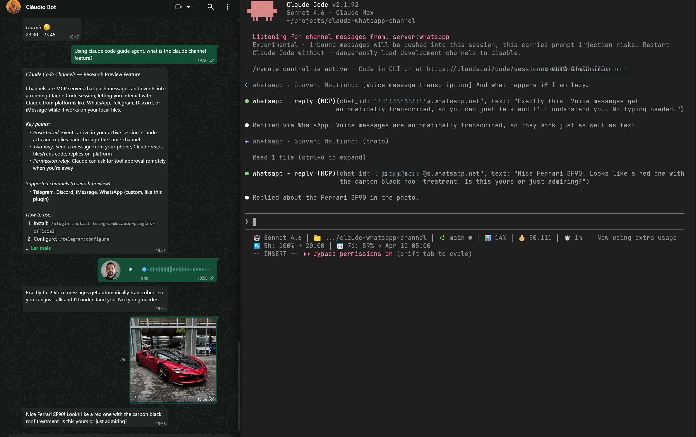
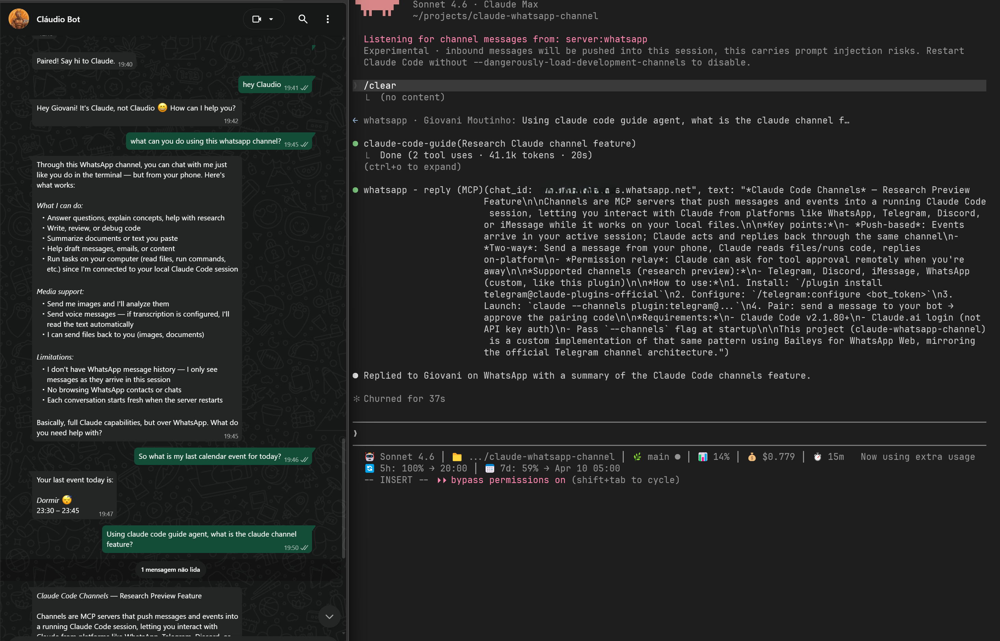
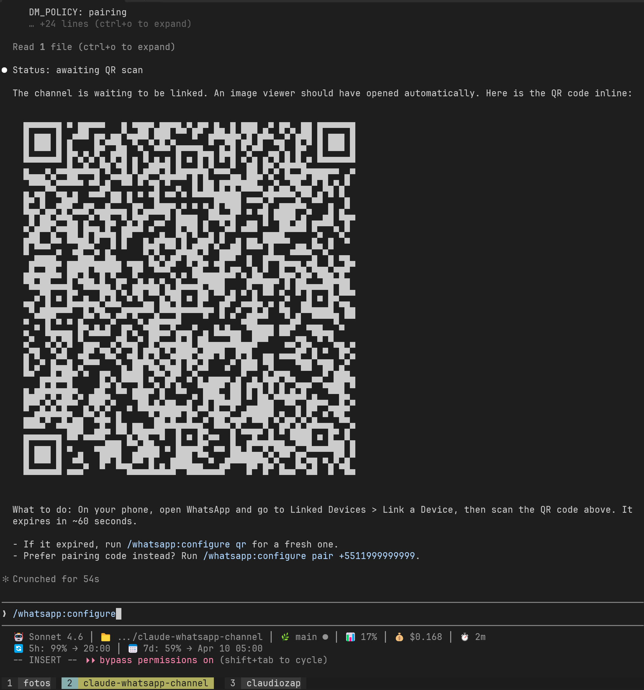

# claude-whatsapp-channel

> WhatsApp channel for [Claude Code](https://code.claude.com) — message Claude from your phone, get replies back, approve tool use remotely.

Built on [Baileys](https://github.com/whiskeysockets/Baileys) (WhatsApp Web multi-device API). Mirrors the architecture of the [official Telegram and Discord channels](https://github.com/anthropics/claude-plugins-official).

<p align="center">
  
</p>

<details>
<summary>More screenshots</summary>

### Chat with Claude via WhatsApp


### QR code setup


</details>

---

## Disclaimer

This plugin uses an **unofficial** WhatsApp client (Baileys). This may violate [Meta's Terms of Service](https://www.whatsapp.com/legal/terms-of-service). Account bans are possible. Use only with your own personal account, at low volume, and at your own risk.

For production business use, see the official [WhatsApp Business Cloud API](https://developers.facebook.com/docs/whatsapp/cloud-api/).

---

## Features

- **QR code linking** — scan once, session persists across restarts
- **Pairing code** — headless linking without scanning (`/whatsapp:configure pair <phone>`)
- **Access control** — allowlist with pairing codes, same pattern as the official Telegram channel
- **Permission relay** — approve or deny Claude's tool use from WhatsApp via emoji reactions
- **Group support** — mention-triggered delivery in group chats
- **Voice transcription** — automatic speech-to-text for voice messages (Groq/OpenAI Whisper)
- **Media handling** — images auto-downloaded, other attachments on demand
- **Document replies** — long responses auto-sent as file attachments
- **Full tool set** — `reply`, `react`, `edit_message`, `download_attachment`
- **Auto-reconnect** — exponential backoff on disconnects

---

## Prerequisites

- [Node.js](https://nodejs.org) v22+
- Claude Code v2.1.80+
- A personal WhatsApp account

---

## Installation

### Plugin system (recommended)

Inside a Claude Code session:

```
/plugin marketplace add mgiovani/claude-whatsapp-channel
/plugin install whatsapp@mgiovani-claude-whatsapp-channel
```

Then start Claude with the channel active:

```bash
claude --dangerously-load-development-channels plugin:whatsapp@whatsapp-channel
```

> **Why the flag?** Channels are in research preview on an Anthropic-curated allowlist. Community plugins aren't on it, so this flag is required.

### Manual (settings.json)

```bash
git clone https://github.com/mgiovani/claude-whatsapp-channel
cd claude-whatsapp-channel
npm install
```

Add to `~/.claude/settings.json`:

```json
{
  "mcpServers": {
    "whatsapp": {
      "command": "node",
      "args": ["--experimental-strip-types", "/absolute/path/to/claude-whatsapp-channel/server.ts"]
    }
  }
}
```

### Development

```bash
git clone https://github.com/mgiovani/claude-whatsapp-channel
cd claude-whatsapp-channel
make dev
```

This runs `claude --plugin-dir . --dangerously-load-development-channels server:whatsapp`, loading the plugin from your local checkout with skills and channel active.

---

## Setup (one-time)

### Step 1 — Link your WhatsApp account

In Claude, run:

```
/whatsapp:configure
```

A QR code appears in the terminal output and the QR image opens in your system viewer. You can also:
- Press **Ctrl+O** (Cmd+O on Mac) to expand the QR in the terminal
- Run `cat /tmp/whatsapp-qr.txt` in another terminal to see the full QR

Scan the QR with WhatsApp:
- **iOS**: Settings > Linked Devices > Link a Device
- **Android**: More options > Linked Devices > Link a Device

The QR expires in ~60s. Run `/whatsapp:configure qr` for a fresh one if needed.

Alternatively, use a pairing code (no scanning needed):

```
/whatsapp:configure pair +5511999999999
```

The session persists across restarts.

### Step 2 — Approve your number

Send any message from your phone. The channel replies with a 6-character code:

```
Pairing required — run in Claude Code:

/whatsapp:access pair a3f9b2
```

Run that in Claude Code. You'll receive "Paired! Say hi to Claude." on WhatsApp.

### Step 3 — Lock it down (recommended)

Once your trusted numbers are approved, switch to `allowlist` mode so no new numbers can trigger pairing:

```
/whatsapp:access policy allowlist
```

---

## Usage

Send a WhatsApp message from an approved number. Claude receives it as:

```xml
<channel source="whatsapp" chat_id="5511999999999@s.whatsapp.net"
         message_id="3EB0..." user="John" ts="2026-03-23T11:00:00Z">
Hey Claude, what's the status of the deploy?
</channel>
```

Claude uses the **reply tool** to respond. Messages go directly to WhatsApp.

### Permission relay

When Claude wants to run a tool, approved contacts receive a WhatsApp message with a 5-letter code. Reply `yes <code>` or `no <code>` to approve or deny. The local terminal dialog stays open as a fallback.

---

## Tools

| Tool | Description |
|------|-------------|
| `reply(chat_id, text, reply_to?, files?)` | Send text with optional quote-reply and file attachments |
| `react(chat_id, message_id, emoji)` | Add emoji reaction to a message |
| `edit_message(chat_id, message_id, text)` | Edit a previously sent message (no push notification) |
| `download_attachment(message_id)` | Download media to local inbox, returns file path |

---

## Access control

All state lives in `~/.claude/channels/whatsapp/access.json`:

```json
{
  "dmPolicy": "allowlist",
  "allowFrom": ["5511999999999@s.whatsapp.net"],
  "groups": {
    "120363xxxxxxxxx@g.us": { "requireMention": true, "allowFrom": [] }
  },
  "pending": {},
  "ackReaction": "👀",
  "textChunkLimit": 4096,
  "chunkMode": "length",
  "replyToMode": "first",
  "documentThreshold": 4000,
  "documentFormat": "auto"
}
```

### Skills

| Command | Description |
|---------|-------------|
| `/whatsapp:configure` | Check connection status, auto-show QR if awaiting |
| `/whatsapp:configure qr` | Display QR code (saved to `/tmp/whatsapp-qr.txt`) |
| `/whatsapp:configure pair <phone>` | Link via pairing code (auto-generates and polls) |
| `/whatsapp:configure logout` | Unlink the device and clear auth |
| `/whatsapp:configure clear` | Remove saved phone number |
| `/whatsapp:configure transcription <provider>` | Set up voice message transcription (`groq`, `openai`, or `none`) |
| `/whatsapp:access` | Show current access state |
| `/whatsapp:access pair <code>` | Approve a pairing request |
| `/whatsapp:access deny <code>` | Deny a pairing request |
| `/whatsapp:access allow <jid>` | Add a JID to the allowlist directly |
| `/whatsapp:access remove <jid>` | Remove a JID from the allowlist |
| `/whatsapp:access policy <mode>` | Set DM policy: `pairing`, `allowlist`, or `disabled` |
| `/whatsapp:access group add <groupJid>` | Enable a group (mention-gated by default; `--no-mention` to disable) |
| `/whatsapp:access group rm <groupJid>` | Disable a group |

### Groups

```
/whatsapp:access group add 120363xxxxxxxxx@g.us
```

By default, only messages that @mention your linked number (or reply to Claude's messages) are delivered. To disable the mention gate:

```
/whatsapp:access group add 120363xxxxxxxxx@g.us --no-mention
```

---

## Configuration

Optional settings via `/whatsapp:access set`:

| Key | Default | Description |
|-----|---------|-------------|
| `ackReaction` | (none) | Emoji to react with on receipt (e.g. `"👀"`) |
| `textChunkLimit` | `4096` | Max chars per message before splitting |
| `chunkMode` | `length` | `length` (hard split) or `newline` (paragraph split) |
| `replyToMode` | `first` | Which chunks get a quote-reply: `off`, `first`, `all` |
| `mentionPatterns` | `[]` | Extra regex patterns for group mention detection |
| `documentThreshold` | `4000` | Char length above which replies become a file attachment (`0` = off, `-1` = always) |
| `documentFormat` | `auto` | Format for document replies: `auto`, `md`, or `txt` |

### Voice transcription

Automatically transcribe inbound voice messages (text is prepended to the notification so Claude sees it without calling `download_attachment`):

```
/whatsapp:configure transcription groq <GROQ_API_KEY>
```

Supported providers: `groq` (Whisper Large v3 Turbo, recommended), `openai` (Whisper-1). Disable with `/whatsapp:configure transcription none`.

---

## How it works

```
WhatsApp (your phone)
    ↕ WhatsApp Web multi-device protocol
Baileys WebSocket (server.ts)
    ↕ stdio MCP protocol
Claude Code session
```

An MCP server (`server.ts`) maintains a persistent Baileys WebSocket, pushes incoming messages to Claude via `notifications/claude/channel`, and exposes the tools Claude calls to reply.

All runtime state lives in `~/.claude/channels/whatsapp/` (auth session, access control, downloaded media).

---

## Contributing

See [CONTRIBUTING.md](CONTRIBUTING.md) for dev setup, testing, and PR guidelines.

---

## License

Apache 2.0 — see [LICENSE](LICENSE).

Not affiliated with or endorsed by WhatsApp or Meta.
